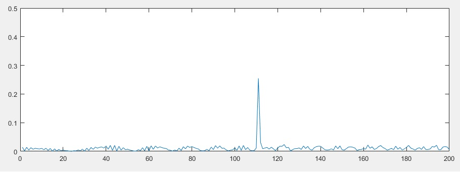

# Radar_Target_Generation_and_Detection
## 1. FMCW Waveform Design
**Criteria:** 

Using the given system requirements, design a FMCW waveform. Find its Bandwidth (B), chirp time (Tchirp) and slope of the chirp.

**MEETS SPECIFICATIONS:**  

For given system requirements the calculated slope should be around 2e13 

**My Code**
 ```matlab
   %% Radar Specifications 
   %%%%%%%%%%%%%%%%%%%%%%%%%%%
   % Frequency of operation = 77GHz
   % Max Range = 200m
   % Range Resolution = 1 m
   % Max Velocity = 100 m/s
   %%%%%%%%%%%%%%%%%%%%%%%%%%%
   B=3e8/(2*1);
   Tchirp=5.5*2*200/3e8;
   slope=B/Tchirp;
   ```
**Result**
 ```matlab
   >> slope

   slope =

      2.0455e+13
 ```
## 2. FMCW Waveform Design
**Criteria:** 

Simulate Target movement and calculate the beat or mixed signal for every timestamp.

**MEETS SPECIFICATIONS:**  

A beat signal should be generated such that once range FFT implemented, it gives the correct range i.e the initial position of target assigned with an error margin of +/- 10 meters.

**My Code**
 ```matlab
   for i=1:length(t)         
    
    
    % *%TODO* :
    %For each time stamp update the Range of the Target for constant velocity. 
    R_cur=R+v*t(i);
    tao=2*R_cur/3e8;
    % *%TODO* :
    %For each time sample we need update the transmitted and
    %received signal. 
    alpha=slope;
    Tx(i) =  cos(2*pi*(fc*t(i)+alpha*t(i)^2/2));
    Rx(i) =  cos(2*pi*(fc*(t(i)-tao)+alpha*(t(i)-tao)^2/2));
    
    % *%TODO* :
    %Now by mixing the Transmit and Receive generate the beat signal
    %This is done by element wise matrix multiplication of Transmit and
    %Receiver Signal
    %Mix(i) =cos(2*pi*(2*alpha*R/3e8*t(i)+2*fc*v/3e8*t(i)));
    Mix(i)=Tx(i).* Rx(i);
   end
   ```


## 3. FMCW Waveform Design
**Criteria:** 

Implement the Range FFT on the Beat or Mixed Signal and plot the result.

**MEETS SPECIFICATIONS:**  

A correct implementation should generate a peak at the correct range, i.e the
initial position of target assigned with an error margin of +/- 10 meters.

**My Code**
 ```matlab
   Mix_2d = reshape(Mix, [Nr, Nd]);
   % *%TODO* :
   %run the FFT on the beat signal along the range bins dimension (Nr) and
   %normalize.
   X=Mix_2d(:,1);
   signal_fft1 = fft(X)./Nr;
   % *%TODO* :
   % Take the absolute value of FFT output
   signal_fft2 = abs(signal_fft1(1:Nr));
   % *%TODO* :
   % Output of FFT is double sided signal, but we are interested in only one side of the spectrum.
   % Hence we throw out half of the samples.

   signal_fft3  = signal_fft2;       

   %plotting the range
   figure ('Name','Range from First FFT')
   subplot(2,1,1)

   % *%TODO* :
   % plot FFT output 
   plot(signal_fft3);

   axis ([0 200 0 0.5]);
   ```
**Result**



## 4. FMCW Waveform Design
**Criteria:** 
1.Implement the 2D CFAR process on the output of 2D FFT operation, i.e the Range Doppler Map.
2.Create a CFAR README File
**MEETS SPECIFICATIONS:**  
1.The 2D CFAR processing should be able to suppress the noise and separate the target signal. The output should match the image shared in walkthrough.
2.In a README file, write brief explanations for the following:

- Implementation steps for the 2D CFAR process.
- Selection of Training, Guard cells and offset.
- Steps taken to suppress the non-thresholded cells at the edges.
